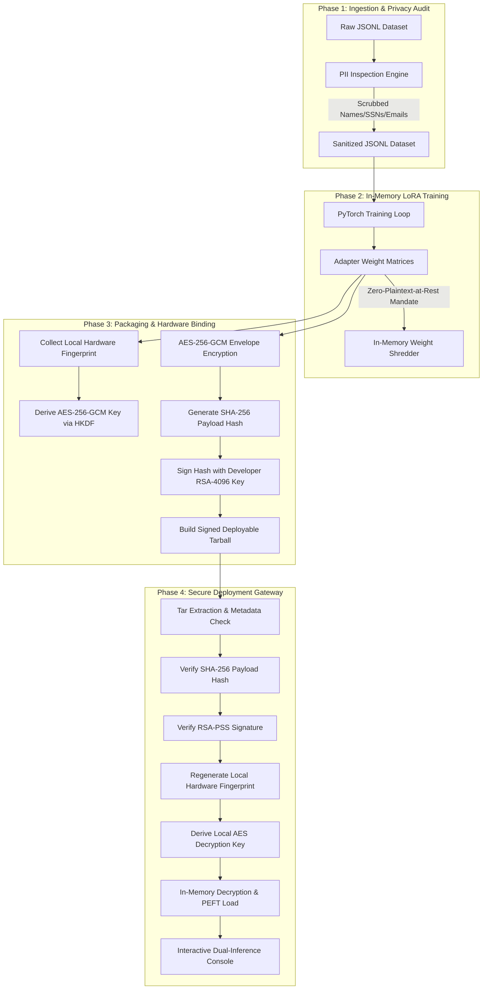

# Secure Device-Bound LoRA Fine-Tuning Framework for LLMs
### Enterprise-Grade Hardware-Bound Parameter-Efficient Fine-Tuning (PEFT) Protection System

---

## 1. Executive Summary & Problem Statement

Deploying fine-tuned Large Language Models (LLMs) to decentralized edge environments (local servers, workstations, consumer devices) exposes proprietary intellectual property and sensitive training data to critical threats. Standard Low-Rank Adaptation (LoRA) adapters are saved as lightweight, unprotected weight matrices (e.g., PyTorch tensors or SafeTensors files) that are easily cloned, reverse-engineered, or run on unauthorized devices. 

Furthermore, training datasets often contain Personally Identifiable Information (PII) or Protected Health Information (PHI) that can be memorized by the model weights during training, leading to compliance violations under GDPR, CCPA, and HIPAA.

This framework introduces a secure, end-to-end MLOps pipeline that:
1. **Prevents Adapter Theft**: Cryptographically binds the LoRA adapter weights to a unique hardware fingerprint of the authorized target device.
2. **Enforces a Zero-Plaintext-at-Rest Mandate**: Decrypts weights entirely in volatile RAM buffers during runtime loading, ensuring that decrypted weights are never written out to non-volatile disk.
3. **Provides Compliance Auditing**: Automatically inspects and scrubs PII from training datasets prior to feeding the local training loop.
4. **Ensures Cryptographic Authenticity**: Signs the package with RSA-PSS digital signatures to detect tampering instantly.

---

## 2. Threat Model & Security Boundaries

```
                    ┌──────────────────────────────────────────────┐
                    │               UNTRUSTED ZONE                 │
                    │   (Storage Cloner, Network Sniffer, Thief)   │
                    └──────────────────────┬───────────────────────┘
                                           │
                                           ▼
┌───────────────────────────────────────────────────────────────────────────────────┐
│                              TRUSTED HARDWARE GATE                                │
│  BIOS UUID + MAC Addr + Motherboard Serial ──► HKDF ──► AES-256-GCM Key           │
└──────────────────────────────────────────┬────────────────────────────────────────┘
                                           │
                                           ▼
                    ┌──────────────────────────────────────────────┐
                    │            IN-MEMORY PLAINTEXT ONLY          │
                    │   Decrypted RAM Buffer ──► PEFT Weight Injection │
                    └──────────────────────────────────────────────┘
```

* **Adversary Capability**: An attacker has physical access to the edge device's storage medium, allowing them to clone the filesystem, copy files, and sniff local configurations. They may attempt to modify files to bypass check gates or load the adapter on a different machine.
* **Security Objectives**:
  * **Confidentiality**: Deployed weights must remain AES-256-GCM encrypted while at rest.
  * **Authenticity & Non-Repudiation**: The adapter package must be signed by an authorized developer keypair to prevent malicious weight injection.
  * **Hardware Lock**: The decryption key must not be stored anywhere on the system; it must be derived dynamically from hardware registers only at model load time.
  * **Integrity**: Any bit-level modification to the archive must invalidate the hash check and GCM authentication tag, leading to a safe, immediate system halt.

---

## 3. System Architecture & High-Level Design (HLD)

The framework coordinates data flow across four distinct, chronological phases, transitioning from raw ingestion to verified inference:



---

## 4. Low-Level Design (LLD) & Component Specifications

### 4.1. Hardware Fingerprint Derivation Engine
The fingerprint engine gathers physical and structural parameters directly from the Linux subsystem to build a host-specific signature.

* **Identifiers Collected**:
  1. **System Machine ID**: Read from `/etc/machine-id` (systemd unique identifier).
  2. **CPU Model String**: Parsed from `/proc/cpuinfo` (processor configuration).
  3. **Disk UUID**: Extracted from the alphabetically first symlink in `/dev/disk/by-uuid/` or queried via the `blkid` system utility.
* **Normalisation**: The gathered properties are sorted, formatted as key-value pairs, and joined using a custom delimiter (`||SECLORA||`) to produce a canonical, immutable hardware representation.
* **Hashing**: The canonical string is processed with a SHA-256 hashing algorithm to yield the final `fingerprint_hash`.

### 4.2. Cryptographic Key Derivation Function (KDF)
To prevent key exposure on disk, keys are generated ephemerally:

$$\text{Key} = \text{HKDF}(\text{IKM} = \text{fingerprint\_hash}, \text{Salt} = \text{P3\_DEVICE\_SALT}, \text{Info} = \text{"lora-binding-key"})$$

* **Algorithm**: HKDF (HMAC Key Derivation Function) built on SHA-256.
* **Salt Rotation**: Driven by a cryptographic salt rotated and passed to the environment dynamically during job staging.

### 4.3. AES-256-GCM Envelope Encryption
Weights are encrypted using authenticated symmetric encryption:

* **Mode**: AES-256-GCM (Galois/Counter Mode).
* **Tag Authentication**: GCM calculates an authentication tag over the ciphertext, providing both confidentiality and integrity verification. Any unauthorized bit modification will trigger a decryption error during runtime.
* **Associated Data (AAD)**: The system fingerprint hash is passed as AAD, embedding the device authorization directly into the ciphertext envelope structure.

### 4.4. RSA-PSS Signature and PKI Authenticity
To verify the origin of the model weights and prevent supply chain injections:
* **Keypair**: Developers sign packages with an RSA-4096 private key.
* **Padding Mode**: PSS (Probabilistic Signature Scheme) with SHA-256 hashing.
* **Decoupled Verification**: During intake, the verifier loads the accompanying public key to validate that the SHA-256 digest of the encrypted weight bundle matches the signed payload.

---

## 5. Detailed Workflow Phase Specifications

### Phase 1: Ingestion & Privacy Auditing
1. The orchestrator receives a raw text or JSONL training dataset.
2. The PII Inspection engine scans the inputs for common compliance patterns:
   * **Social Security Numbers (SSN)**: `\b\d{3}-\d{2}-\d{4}\b`
   * **Email Addresses**: RFC 5322 compliant regex.
   * **Passwords / Secrets**: Common environment keys, API tokens, and credentials.
   * **Custom Names & Identifiers**: Configurable lookup profiles.
3. If matches are found, they are replaced with custom mask tags (e.g., `[MASKED_SSN]`, `[MASKED_EMAIL]`).
4. The sanitized output is written out as a clean template.

### Phase 2: In-Memory LoRA Fine-Tuning
1. A background PyTorch trainer process is dynamically spawned by the orchestrator.
2. The sanitized dataset is tokenized and fed into the target base model (e.g., Hugging Face `llama-68m` or similar).
3. The LoRA parameters are isolated and updated during backpropagation while the base model weights remain frozen.
4. Plaintext intermediate files are subjected to the **Zero-Plaintext-at-Rest Mandate**:
   * Intermediate weights are stored only inside volatile memory.
   * Discarded weight snapshots are cleared from memory buffers using Python garbage collection, and temporary folders are purged using recursive disk cleanup scripts.

### Phase 3: Cryptographic Protection & Hardware Binding
1. The packaging engine calculates the system fingerprint hash.
2. An ephemeral AES-256 key is derived from the fingerprint and job salt.
3. The LoRA adapter weights (stored in `adapter_model.bin` or `adapter_model.safetensors`) are encrypted using the derived key.
4. A metadata file (`metadata.json`) containing the encryption parameters (salt, IV, auth tag, AAD) is compiled.
5. The SHA-256 hash of the encrypted bundle is signed using the developer's RSA private key.
6. The files (encrypted weights, signature, hash, public key, and manifest) are packed into a secure compressed tarball (`.tar.gz`).

### Phase 4: Secure Deployment Gateway & PEFT Decryption
The deployment gateway validates the package on the client machine before loading the model:
1. **Extract**: Unpacks the `.tar.gz` package into memory/transient disk.
2. **Hash Check**: Calculates the SHA-256 hash of the encrypted weight file and validates it against the packaged `.hash` file.
3. **Signature Check**: Verifies the signature of the hash using the packaged RSA public key.
4. **Hardware Validation**: Collects the host machine's hardware parameters, hashes them, and checks if they match the fingerprint target embedded in the metadata.
5. **Decryption**: Derives the local AES key and decrypts the weights.
6. **PEFT Integration**: Binds the decrypted weights directly to the base model structure in RAM. All temporary plaintext weights on disk are shredded immediately using a multi-pass secure wipe.

---

## 6. Security Simulation & Audit Validation Suite

To demonstrate system safety under adversarial conditions, the orchestrator executes two automated simulation pipelines:

### 6.1. Tamper Evidence and Bit-Corruption Integrity Verification
* **Simulation Process**:
  1. The orchestrator copies the signed, encrypted adapter package.
  2. It opens the archive as a raw binary stream, seeks to an arbitrary offset (e.g., offset `100`), and writes arbitrary bytes (e.g., `\x00\x00\x00`), physically corrupting the archive.
  3. It attempts to deploy this corrupted archive through the Phase 4 gate.
* **Expected Result**: The SHA-256 hash check fails, or the GCM authentication tag fails verification. The deployment pipeline aborts immediately, outputting an `IntegrityValidationError`. The adapter is never decrypted, and the model loader is blocked from reading the weights.

### 6.2. Salt Mutation & Unauthorized Device Prevention
* **Simulation Process**:
  1. The orchestrator attempts to load a valid adapter package.
  2. During key derivation, it introduces a mutated salt (simulating an unauthorized CPU or mother-board hardware profile).
  3. It attempts to decrypt the adapter using the key derived from this mutated profile.
* **Expected Result**: The GCM decryption routine fails to match the authentication tag. The pipeline catches the `DeviceAuthorizationError`, blocks the loading of the model, and wipes all transient directories immediately.

---

## 7. Interactive Telemetry & Dashboard Design

```
┌───────────────────────────────────────────────────────────────────────────────┐
│  LoRA Device Binding Framework Dashboard                                      │
├───────────────────────────────────────────────────────────────────────────────┤
│                                                                               │
│  [ ACTIVE PIPELINE PHASE ]                                                    │
│  (Intake) ===► (PII Audit) ===► (Fine-Tune) ===► (Packaging) ===► (Verify) ...│
│     🟢            🟢               🟢             🔵 (glowing)      ⚪        │
│                                                                               │
│  [ DEPLOYMENT VERIFICATION GATES ]                                            │
│  1. Package Intake Verification  .................................... [ PASS ] │
│  2. SHA-256 Integrity Check      .................................... [ PASS ] │
│  3. RSA-PSS Digital Signature    .................................... [ PASS ] │
│  4. Hardware Fingerprint Match   .................................... [ PASS ] │
│                                                                               │
└───────────────────────────────────────────────────────────────────────────────┘
```

The system provides a real-time visualization portal to track the status of the pipeline:
* **Active Phase Flow**: A dynamic progress stepper that visualizes the dataset lifecycle. It transitions from grey (pending) to cyan (active) to green (completed) as the pipeline advances.
* **Verification Checklist**: A step-by-step audit grid showing the validation of cryptographic constraints (Intake, Integrity, Signatures, Fingerprint checks, Key Derivation, PEFT load).
* **Side-by-Side Inference Playground**: Allows real-time evaluation of the model before and after the secure adapter load. Users can input prompts and compare raw base model output side-by-side with the fine-tuned, device-locked adapter output.
* **Log Redaction Console**: A real-time subprocess log display that automatically filters out sensitive patterns like emails, SSNs, or keys using regular expressions, maintaining operational security during debugging.
