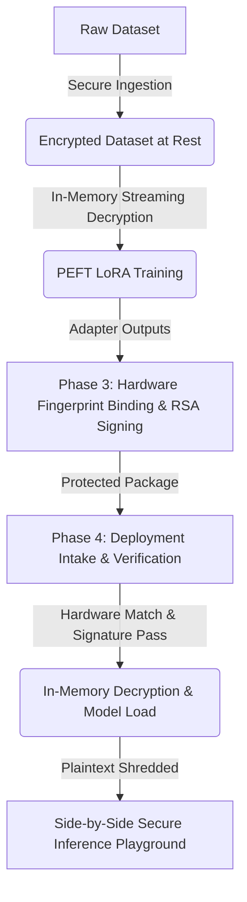

# Secure Device-Bound LoRA Fine-Tuning Framework

Fine-tuning Large Language Models (LLMs) on high-sensitivity corporate data poses a double-sided security challenge: private training datasets are vulnerable to leakage if stored in plaintext, and proprietary adapter weights are vulnerable to theft if deployed on unauthorized, non-compliant devices.

The **Secure Device-Bound LoRA Framework** solves both challenges. Designed as a complete, secure pipeline, this framework ensures that training data remains fully encrypted at rest, model training happens entirely in-memory, and deployed LoRA adapters can only be decrypted and loaded on authorized hardware targets matching a cryptographically verified system fingerprint.

---

## 🌟 Core System Design

The framework is structured as a series of secure, chronological phases that form a complete security chain:



### 1. Secure Dataset Ingestion & Training (Phases 1 & 2)
Raw datasets containing sensitive user records or Personally Identifiable Information (PII) are ingested and converted into an AES-256-GCM encrypted format. 
* **Zero-Plaintext-at-Rest:** The training engine streamingly decrypts data directly into transient RAM buffers, tokenizes them, and immediately shreds the plaintext variables.
* **Checkpoint Security:** Training checkpoints are written out securely, automatically rotating to keep disk footprints clean.

### 2. Device Fingerprint Binding & RSA Signing (Phase 3)
Once training is complete, the resulting LoRA adapter weights are packed and cryptographically bound to the target deployment hardware:
* **System Fingerprint:** Aggregates machine identifiers (system UUIDs, CPU models, disk structures) into a canonical fingerprint hash.
* **Digital Signatures:** The package is signed using an RSA-PSS keypair, ensuring complete authenticity and tamper-evidence before it is shipped.

### 3. Verification & Inference Validation (Phase 4)
The deployment engine acts as a secure gateway on the host machine:
1. **Completeness & Integrity Check:** Validates that the package structure is intact and computes the SHA-256 hash of the payload.
2. **Signature Verification:** Validates the RSA-PSS signature against the public key to ensure the package hasn't been altered.
3. **Hardware Authorization:** Regenerates the local system fingerprint and compares it to the target binding.
4. **Decryption & Loading:** Re-derives the AES-256 key to decrypt the weights. Plaintext files exist only momentarily on disk and are securely shredded (3-pass random overwrite) the instant they are loaded into RAM.

---

## 💻 The Verification Dashboard

To make this complex cryptographic process intuitive and visual, the project includes an interactive web portal. The dashboard provides a visual control center for system administrators and developers:

* **Real-time Pipeline Gates:** Visualizes the 8 stages of Phase 4 verification. Step indicators change dynamically from PENDING to PASSED (green) or FAILED (red).
* **Live System Info:** Displays the local machine's fingerprint hash prefix and the active salt.
* **Side-by-Side Playground:** Evaluates model performance in real time. Submit prompts to view predictions generated by the base LLM alongside responses enhanced by the authorized LoRA adapter.
* **Secure Logs Panel:** Streamlines system diagnostics with output-masking rules that redact sensitive patterns (like emails, SSNs, or keys) from log outputs.

---

## 🚀 Running the Framework

Start by initializing your environment and installing the required dependencies:

```bash
python3 -m venv venv
source venv/bin/activate
pip install -r requirements.txt
```

### 1. Ingest and Format the Dataset
Download, format, and encrypt the sample masking dataset:
```bash
python3 -m src.phase1.cli encrypt
```

### 2. Train the Adapter
Train the PEFT model on the encrypted training data:
```bash
python3 -m src.phase2.train_lora
```

### 3. Package and Bind to Hardware
Generate the signed, hardware-bound adapter package:
```bash
python3 -m src.phase3.main protect --archive
```

### 4. Deploy and Verify
Verify, decrypt, and launch the model via the interactive portal:
```bash
python3 -m src.evaluation.dashboard
```
Navigate to `http://localhost:5005` in your browser. Click **Verify & Load Adapter** to execute the verification pipeline, load the adapter into RAM, and unlock the comparative inference playground.

