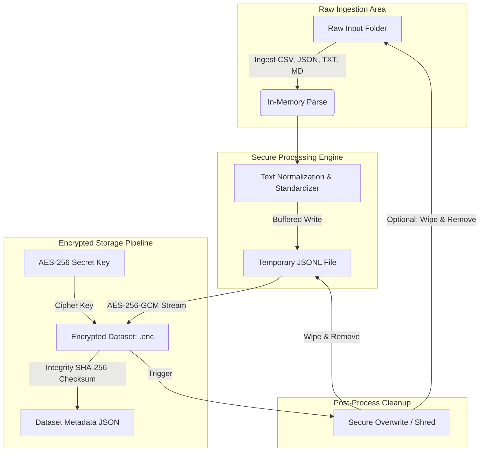

# Secure Device-Bound LoRA Fine-Tuning Framework for LLMs

## Phase 1: Secure Dataset Protection

This module provides a secure preprocessing, ingestion, and encrypted storage pipeline for corporate training datasets. The primary security objective is that **sensitive raw dataset content is never stored in plaintext on persistent disk**. All plaintext inputs are ingested, processed, and encrypted streamingly or within isolated temporary memory buffers, followed by cryptographic shredding of any intermediate files.

---

## 1. Architectural Design



### Key Framework Components
1. **`secure_lora/security.py`**: Implementation of AES-256-GCM chunked file encryption/decryption streams, cryptographic shredding (overwriting multiple times with random bytes and flushing before deletion), and SHA-256 checksum utilities.
2. **`secure_lora/ingestion.py`**: Flexible ingestion mechanics for reading and parsing `.txt`, `.csv`, `.json`, and `.md` files.
3. **`secure_lora/preprocessing.py`**: Logic to strip whitespaces, remove non-printable characters, filter blank records, and map varying field naming schemes into standardized Alpaca instructions or Causal LM text fields.
4. **`secure_lora/pipeline.py`**: Core pipeline manager coordinating the lifecycle of raw ingestion, preprocessing, encrypted storage, and cleanups.
5. **`secure_lora/cli.py`**: CLI command parser for administrators to manage key generation, dataset encryption, decryption exports, and file integrity verification.

---

## 2. Directory Layout
```
/home/abhishek/Projects/MAJOR_PROJECT/
├── secure_lora/
│   ├── __init__.py           # Package exports
│   ├── security.py           # Cryptographic engines
│   ├── ingestion.py          # Multiformat file parsers
│   ├── preprocessing.py      # Text cleansers and format standardizers
│   ├── pipeline.py           # Pipeline coordinator
│   └── cli.py                # CLI Entrypoint
├── tests/
│   └── test_pipeline.py      # Integration and security tests
├── requirements.txt          # Python dependency list
└── README.md                 # Framework documentation (This file)
```

---

## 3. Cryptographic Defenses

### A. STREAM Authenticated Encryption (AES-256-GCM)
Rather than encrypting the entire file in memory (which causes Out-Of-Memory exceptions on large files), we implement a streaming cipher using chunk sizes of `64 KB`. To prevent chunk-level manipulation, we bind the encryption parameters to **Associated Data (AD)**.
Each chunk payload layout:
$$\text{nonce (12B)} \mathbin{\Vert} \text{payload\_len (4B)} \mathbin{\Vert} \text{is\_final (1B)} \mathbin{\Vert} \text{encrypted\_payload (varB)}$$

- **Replay & Swap Defense**: The Associated Data contains the 0-based chunk index. If an attacker swaps chunk $A$ and $B$, GCM verification will fail during decryption because the chunk index in the AD will not match.
- **Truncation Defense**: The last chunk is marked with `is_final = 1` in the AD and chunk header. If the file is truncated before the final block, the decrypter throws an error.

### B. In-Memory Decryption for Training
To feed training engines (like Hugging Face `transformers` or `PEFT` LoRA), the framework implements `decrypt_generator`. It decrypts chunks, parses lines streamingly, and yields JSON dictionary objects directly to the memory stack. **At no point during training is a plaintext dataset written to disk.**

### C. Cryptographic Shredding
Standard OS delete operations (`os.remove` or `Path.unlink`) only release pointers, leaving plaintext blocks on disk. Our `secure_delete_file` utility performs a secure shredding operation:
1. Opens the file in binary update mode with zero-buffering.
2. Overwrites the file data with secure random bytes (`os.urandom`) for multiple passes.
3. Calls `os.fsync` to force OS flush to physical sectors.
4. Renames the file to a random name to hide metadata before finally deleting it.

---

## 4. Environment Variable Configuration (.env)

The framework supports loading configuration variables directly from a `.env` file located in the project root. This avoids hardcoding sensitive paths or keys.

A template is provided in `.env.example`. A default `.env` was generated with a secure random 256-bit AES key.

### Configuration Fields
* `SECURE_LORA_KEY_HEX`: Hexadecimal representation of the 32-byte (256-bit) encryption key (64 hex characters). If set, this takes priority.
* `SECURE_LORA_KEY_PATH`: Alternative path to a secure key file containing the 32-byte raw binary key.
* `SECURE_LORA_INPUT_DIR`: Default input folder containing raw text datasets.
* `SECURE_LORA_OUTPUT_DIR`: Default output folder for storing encrypted files and metadata.
* `SECURE_LORA_DATASET_NAME`: Default name of the dataset.
* `SECURE_LORA_DATASET_VERSION`: Default dataset version tag.

If variables are defined in `.env`, corresponding CLI arguments become **optional** and fallback to these environment values automatically.

---

## 5. Setup and Execution

### Prerequisites
Install the required dependencies:
```bash
pip install -r requirements.txt
```

### CLI Command Reference

#### 1. Generate a Secure Key
Generate a 256-bit AES key and protect it with strict read/write owner-only permissions (`0600` on Linux):
```bash
python -m secure_lora.cli generate-key -k secrets.key
```

#### 2. Encrypt a Raw Dataset Directory
Process all `.txt`, `.csv`, `.json`, and `.md` files in a source directory, encrypt the standardized dataset, and generate metadata:
```bash
python -m secure_lora.cli encrypt \
  -i /path/to/raw_inputs \
  -o /path/to/secure_outputs \
  -k secrets.key \
  -n CorporateFinancesDataset \
  -v 1.0.0
```
*Add the `--shred-raw` flag to securely wipe the original raw inputs from disk once encryption finishes.*

#### 3. Decrypt a Dataset for Export or Verification
Decrypt an encrypted file back into a plaintext `.jsonl` document (only recommended for validation):
```bash
python -m secure_lora.cli decrypt \
  -e /path/to/secure_outputs/encrypted_dataset.enc \
  -o /path/to/audit_output.jsonl \
  -k secrets.key
```

#### 4. Verify Integrity check
Verify the encrypted payload size and SHA-256 signature against its metadata:
```bash
python -m secure_lora.cli verify \
  -e /path/to/secure_outputs/encrypted_dataset.enc \
  -m /path/to/secure_outputs/dataset_metadata.json
```

---

## 6. Integration with Phase 2 Training

During training, we leverage Hugging Face's `datasets.Dataset.from_generator` to consume our streaming decryptor. This ensures zero disk leakages:

```python
from datasets import Dataset
from secure_lora.security import decrypt_generator

# Load key securely from path/env
with open("secrets.key", "rb") as kf:
    secret_key = kf.read()

def streaming_dataset_generator():
    yield from decrypt_generator(
        encrypted_file_path="secure_outputs/encrypted_dataset.enc", 
        key=secret_key
    )

# Load into Hugging Face in-memory representation
hf_dataset = Dataset.from_generator(streaming_dataset_generator)

# Ready for Tokenization and PEFT / LoRA Training!
print(hf_dataset[0])
```
