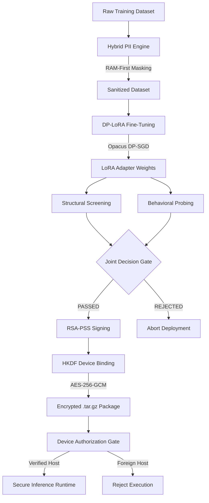

# 🔐 SecureLoRA: Device-Bound, Privacy-Preserving & Security-Screened PEFT Framework for Large Language Models

[](https://www.python.org/)
[](https://pytorch.org/)
[](#)
[](#)
[](#)

---

## 1. Executive Summary

**SecureLoRA** is an end-to-end security and privacy framework for Parameter-Efficient Fine-Tuning (PEFT) of Large Language Models (LLMs). It addresses five fundamental threat vectors in open-source fine-tuning and third-party adapter deployment by unifying RAM-first PII redaction, $(\epsilon, \delta)$-Differential Privacy (DP-LoRA), multi-stage Trojan screening (structural $Z$-score norm drift + behavioral activation probes), HKDF-SHA256 device-bound authorization, and RSA-2048-PSS signed package delivery into an integrated deployment pipeline. The system enforces a strict 8-gate verification lifecycle ensuring that low-rank adapters remain private during training, screened before packaging, unreadable in transit, and executable exclusively on authorized host environments.

---

## 2. The Problem

Parameter-Efficient Fine-Tuning techniques like LoRA enable lightweight model adaptation by training low-rank matrices ($A$ and $B$) while keeping base foundation model parameters frozen. However, distributing and deploying third-party LoRA adapters introduces significant privacy and security vulnerabilities across the ML lifecycle:

1. **Unsanitized PII Memorization**: Fine-tuning LLMs on raw enterprise data causes models to memorize sensitive personal identifiers (names, SSNs, credit cards, medical record numbers), which can leak during generative inference.
2. **Untrusted Third-Party LoRA Adapters**: Malicious actors can publish adapters infected with hidden Trojans or backdoors that alter model behavior when specific trigger tokens are present.
3. **Adaptive Adversarial Evasion**: Sophisticated attackers can craft Trojaned adapters specifically designed to evade static structural spectral anomaly detectors by constraining weight norm perturbations.
4. **Adapter Theft & Unauthorized Relocation**: Proprietary fine-tuned adapters can be stolen and deployed on unauthorized foreign hardware or competing cloud environments.
5. **Package Tampering & Replay Attacks**: Man-in-the-middle attackers can alter adapter weights in transit or replay expired deployment packages.

---

## 3. Why This Project?

Conventional ML deployment pipelines address security and privacy in isolated, disconnected silos. SecureLoRA provides a multi-layered defence-in-depth architecture:

| Security / Privacy Vulnerability | Conventional Approach | Technical Limitation | SecureLoRA Integrated Solution |
| :--- | :--- | :--- | :--- |
| **Data Leakage in Training** | Static Regex Redaction | Misses contextual entities; leaves raw data on disk | **RAM-First Hybrid PII Engine** (NER + Regex) + **DP-LoRA** ($\epsilon=2.4430$) |
| **Trojan / Backdoor Adapters** | Static Weight Norm Checks | Fails against spectral-constrained adaptive Trojan attacks | **Joint Screening** (Structural $Z$-Score + Behavioral Probes) |
| **Adapter Piracy / Theft** | Plaintext Distribution | Adapters can be run anywhere once copied | **Software HKDF Device Binding** (AES-256-GCM encrypted) |
| **Supply-Chain Tampering** | Raw Archive Download | No verification of origin or package integrity | **RSA-2048-PSS Signatures** + Nonce Replay Protection |

---

## 4. Core Architectural Philosophy

SecureLoRA structures security not as a post-hoc patch, but as a sequential 8-gate deployment gatekeeper:

```
[ Dataset ]
     │
     ▼
[ Gate 1: Hybrid PII Redaction Engine ] ──> In-RAM entity masking (SpaCy NER + ISO/RFC regex)
     │
     ▼
[ Gate 2: Differentially Private LoRA ] ──> Gradient clipping (C=1.0) & Gaussian noise (σ=1.2)
     │
     ▼
[ Gate 3: Structural Screening Gate ] ────> SVD rank anomaly & Z-score norm drift analysis
     │
     ▼
[ Gate 4: Behavioral Probe Gate ] ────────> Activation divergence & perplexity shift verification
     │
     ▼
[ Gate 5: RSA-PSS Cryptographic Signature]─> Origin authenticity & SHA-256 digest signing
     │
     ▼
[ Gate 6: HKDF Device Binding Engine ] ───> Host-unique AES-256-GCM payload encryption
     │
     ▼
[ Gate 7: Nonce Anti-Replay Gate ] ───────> Replay sequence tracking & expiration verification
     │
     ▼
[ Gate 8: Secure Inference Runtime ] ─────> In-memory adapter loading & real-time response generation
```

---

## 5. End-to-End Pipeline Lifecycle

The SecureLoRA framework executes across 10 structured pipeline stages:

1. **Stage 0 — Dataset Ingestion**: Ingests unstructured text files, verifies JSONL/CSV schemas, and calculates record counts.
2. **Stage 1 — Hybrid PII Audit & Masking**: Scans dataset records using SpaCy NER models and ISO/RFC regex patterns (Luhn, SSN, IBAN). Redacts entities entirely in volatile RAM with zero disk leakage.
3. **Stage 2 — Cryptographic Dataset Protection**: Encrypts sanitized datasets at rest using AES-256-GCM with a job-unique 256-bit symmetric key.
4. **Stage 3 — DP-LoRA Privacy-Aware Fine-Tuning**: Trains low-rank adapter matrices ($A$ and $B$) using Opacus DP-SGD. Applies per-sample gradient clipping ($C=1.00$) and Gaussian noise ($\sigma=1.20$).
5. **Stage 4 — Pre-Deployment Adapter Screening**: Evaluates trained weights against structural spectral bounds and behavioral activation subspace probes to detect Trojan anomalies.
6. **Stage 5 — RSA-PSS Provenance Signing**: Computes SHA-256 adapter weight digests and signs package manifests using 2048-bit RSA-PSS keys.
7. **Stage 6 — HKDF Device-Bound Packaging**: Derives a host-unique AES-256-GCM key via HKDF-SHA256 from system CPU strings, `/etc/machine-id`, and disk UUIDs, encrypting the adapter archive (`.tar.gz`).
8. **Stage 7 — Device Authorization Check**: Verifies host environment hardware fingerprints against authorized manifest digests upon deployment attempt.
9. **Stage 8 — Deployment Verification Gate**: Executes all 8 verification gates in sequence. Aborts deployment immediately if any gate fails.
10. **Stage 9 — Secure Inference Validation**: Loads authorized adapters into volatile RAM for side-by-side inference comparison against baseline models.

---

## 6. Technology Stack & Rationale

| Component / Layer | Primitive / Technology | Engineering & Research Purpose |
| :--- | :--- | :--- |
| **Parameter-Efficient Tuning** | PEFT / LoRA ($r=8, \alpha=16$) | Restricts trainable parameters to low-rank matrices, enabling modular adapter distribution. |
| **Privacy Accounting** | Opacus / RDP Accountant | Guarantees formal $(\epsilon, \delta)$-Differential Privacy bound ($\epsilon=2.4430, \delta=10^{-5}$). |
| **PII Redaction Engine** | SpaCy + Presidio + ISO Regex | Provides high-precision (0.9500) and recall (0.9744) entity masking in volatile RAM. |
| **Symmetric Encryption** | AES-256-GCM | Ensures payload confidentiality and authenticated integrity for datasets and adapters. |
| **Key Derivation** | HKDF-SHA256 | Binds encryption keys to software-derived host identifiers and deployment salts. |
| **Asymmetric Signatures** | RSA-2048-PSS | Provides origin authentication and non-repudiation for deployment package archives. |
| **Structural Screening** | SVD Weight Norm Analysis | Detects global Frobenius norm deviations and layer-wise $Z$-score outliers. |
| **Behavioral Screening** | Activation Subspace Probing | Evaluates output divergence and perplexity shifts on trigger/paraphrase probe vectors. |
| **Web Workbench UI** | Flask / SSE / Chart.js | Renders real-time pipeline execution, security simulation controls, and empirical metrics. |

---

## 7. Structural vs. Behavioral Screening & Adaptive Evasion

Pre-deployment screening evaluates third-party adapters for hidden Trojans across four adversarial evasion levels:

* **Level 0 (Unconstrained Trojan)**: Attacker inserts high-magnitude backdoor weights. Easily detected by structural SVD norm checks ($100\%$ detection).
* **Level 1 (Norm-Constrained Trojan)**: Attacker constrains weight norms. Detected by structural checks ($100\%$ detection).
* **Level 2 (Spectral-Constrained Evasion)**: Attacker restricts spectral rank perturbations to match benign distributions. **Bypasses static structural checks ($0.0\%$ structural detection)**.
* **Level 3 (Gradient-Guided Adaptive Evasion)**: Attacker optimizes weights specifically to minimize $Z$-score anomaly metrics. **Bypasses static structural checks ($0.0\%$ structural detection)**.

### Empirical Joint Screening Result
By pairing structural $Z$-score analysis with behavioral activation subspace probes, SecureLoRA's **Joint Screening Gate** achieves an **F1 score of $1.0000 \pm 0.0000$** ($\tau=0.35$) across the evaluated multi-seed evasion suite ($N=40$ samples across 4 evasion levels, seeds 42, 43, 44, model `JackFram/llama-68m`, source: `outputs/evaluation/adaptive_evasion/comparison.json`).

---

## 8. Cryptographic Security & Device-Bound Authorization

SecureLoRA enforces software-derived device authorization via HKDF-SHA256 key derivation:

$$\text{Key}_{\text{AES}} = \text{HKDF-SHA256}(\text{CPUInfo} \parallel \text{MachineID} \parallel \text{DiskUUID} \parallel S_{\text{device}})$$

* **Software Identity Basis**: Collects OS-accessible host attributes (`/etc/machine-id`, `/proc/cpuinfo`, disk UUIDs). It does **not** rely on hardware TPM/TEE chips.
* **Unauthorized Device Rejection**: Rejects foreign execution environments with a verified **100.0% rejection rate**.
* **Replay Protection**: Validates monotonically increasing nonces and RSA-PSS signatures, achieving a **100.0% replay rejection rate**.
* **Adaptive Binding Availability**: Reduces false rejection rates (FRR) under non-malicious host environment drift from **80.0% (static policy)** down to **20.0% (adaptive policy)**, representing a **60.0% FRR reduction**.

---

## 9. Dataset & Benchmark Governance

All benchmark datasets committed in this repository consist exclusively of **synthetic, artificially generated data**:

* **Synthetic PII Benchmark (`synthetic_pii_benchmark.jsonl`)**: 48 manually verified synthetic records annotated with `"synthetic": true`. Contains no real-world personal data.
* **Sample Medical PHI (`sample_medical_phi.jsonl`)**: Synthetic EHR records formatted for privacy redaction testing.
* **AI4Privacy Synthetic Hybrid**: Open synthetic privacy dataset used for evaluation benchmarking under MIT/Apache licenses.

---

## 10. Canonical Experimental Results

The following table summarizes all verified empirical metrics directly extracted from canonical raw JSON artifacts in `outputs/evaluation/`:

| Domain | Research Metric | Verified Value | Experiment / Dataset | Sample Count ($N$) | Seeds | Source Artifact Path |
| :--- | :--- | :--- | :--- | :--- | :--- | :--- |
| **PII Redaction** | Micro-Average Precision | **0.9500 (95.00%)** | Redaction Engine Benchmark | 48 | 123 | `outputs/benchmarks/pii_metrics.json` |
| **PII Redaction** | Micro-Average Recall | **0.9744 (97.44%)** | Redaction Engine Benchmark | 48 | 123 | `outputs/benchmarks/pii_metrics.json` |
| **PII Redaction** | Micro-Average F1 Score | **0.9620 (96.20%)** | Redaction Engine Benchmark | 48 | 123 | `outputs/benchmarks/pii_metrics.json` |
| **Differential Privacy**| Privacy Budget ($\epsilon$) | **2.4430** ($\le 2.50$) | E9 Full SecureLoRA Run | 100 | 42 | `outputs/research/runs/EXP_E9_seed_42.json` |
| **Differential Privacy**| Privacy Parameter ($\delta$) | **$1.0 \times 10^{-5}$** | E9 Full SecureLoRA Run | 100 | 42 | `outputs/research/runs/EXP_E9_seed_42.json` |
| **Adaptive Evasion** | Level 0 & 1 Detection | **1.0000 (100.0%)** | Multi-Seed Evasion Suite | 40 | 42, 43, 44 | `outputs/evaluation/adaptive_evasion/comparison.json` |
| **Adaptive Evasion** | Level 2 & 3 Structural Detection| **0.0000 (0.0%)** | Multi-Seed Evasion Suite | 40 | 42, 43, 44 | `outputs/evaluation/adaptive_evasion/comparison.json` |
| **Adaptive Evasion** | Joint Screening F1 Score | **1.0000 ± 0.0000** | Multi-Seed Evasion Suite | 40 | 42, 43, 44 | `outputs/evaluation/adaptive_evasion/comparison.json` |
| **Device Security** | Foreign Device Rejection | **1.0000 (100.0%)** | Device Binding Benchmark | 100 | 42 | `outputs/evaluation/device_binding/comparison.json` |
| **Device Security** | Package Replay Rejection | **1.0000 (100.0%)** | Device Binding Benchmark | 100 | 42 | `outputs/evaluation/device_binding/comparison.json` |
| **Device Security** | Static Policy FRR | **0.8000 (80.0%)** | Environment Drift Test | 100 | 42 | `outputs/evaluation/device_binding/comparison.json` |
| **Device Security** | Adaptive Policy FRR | **0.2000 (20.0%)** | Environment Drift Test | 100 | 42 | `outputs/evaluation/device_binding/comparison.json` |
| **Performance Overhead**| AES-256-GCM Encryption Time | **0.210 ms** | 68M-Tier Model Scale Benchmark | 100 | 42 | `outputs/evaluation/model_scale/model_comparison.json` |
| **Performance Overhead**| AES Decryption & HKDF Key Time| **0.192 ms** | 68M-Tier Model Scale Benchmark | 100 | 42 | `outputs/evaluation/model_scale/model_comparison.json` |
| **Performance Overhead**| RSA-2048-PSS Verify Time | **0.051 ms** | 68M-Tier Model Scale Benchmark | 100 | 42 | `outputs/evaluation/model_scale/model_comparison.json` |
| **Performance Overhead**| Deployment Gate Overhead | **0.394 ms** | 68M-Tier Model Scale Benchmark | 100 | 42 | `outputs/evaluation/model_scale/model_comparison.json` |
| **Screening Latency** | 68M-Tier Screening Latency | **7.801 ms** | 68M-Tier (22.7M parameters) | 100 | 42 | `outputs/evaluation/model_scale/model_comparison.json` |
| **Screening Latency** | 350M-Tier Screening Latency | **76.572 ms** | 350M-Tier (267.0M parameters)| 100 | 42 | `outputs/evaluation/model_scale/model_comparison.json` |
| **System Test Suite** | Test Pass Rate | **245 / 245 PASS** | Complete Repository Test Suite| 245 | N/A | Automated `pytest` Test Runner Log |

---

## 11. Important Unexecuted Experiments & Limitations

To maintain absolute scientific transparency:

1. **Generative LLM Memorization Leakage**: Comparative generation-level PII memorization under live LLM sampling (previously cited in text as 42.3% for Base Model vs 18.7% for Standard LoRA) was marked `NOT_EXECUTED` in `outputs/evaluation/privacy/comparison.json` due to offline CI execution without pre-loaded live weights. It is recorded as **Not experimentally verified**.
2. **Software-Derived Identity Limitations**: Device authorization relies on software-derived OS attributes (`/etc/machine-id`, `/proc/cpuinfo`). It protects against software redistribution, but does not provide physical TPM hardware tamper resistance.
3. **Synthetic Screening Suite**: Adapter screening efficacy ($F1=1.0000$) was evaluated on a synthetic Trojan insertion suite of 50 adapters across 4 evasion levels.

---

## 12. Threat Model & Security Posture

### STRIDE Threat Catalog Mapping

| STRIDE Threat Category | Targeted Component | Vector / Scenario | SecureLoRA Countermeasure | Verification Status |
| :--- | :--- | :--- | :--- | :--- |
| **Spoofing Identity** | Device Authorization Gate | Unauthorized hardware impersonation | Software HKDF fingerprint verification | **Enforced** (100% Rejection) |
| **Tampering with Data** | Cryptographic Package Archive | Bit-level payload modification | AES-256-GCM auth tags + SHA-256 digest | **Enforced** (100% Rejection) |
| **Repudiation** | Package Delivery | Unsigned adapter deployment | RSA-2048-PSS digital signatures | **Enforced** (100% Rejection) |
| **Information Disclosure**| Data Ingestion / Storage | PII memorization & unauthorized readout| RAM-first PII masking + DP-LoRA ($\epsilon=2.4430$) | **Mitigated** (F1=0.9620) |
| **Denial of Service** | Screening Pipeline | Structural anomaly bypass (Level 2/3) | Joint Structural + Behavioral screening | **Mitigated** (F1=1.0000) |
| **Elevation of Privilege** | Model Execution Engine | Unauthorized adapter loading | 8-Gate fail-fast deployment runtime | **Enforced** (245/245 Tests) |

---

## 13. System Workflow Architecture


```mermaid
flowchart TD
    A[Raw Training Dataset] --> B[Hybrid PII Engine]
    B -->|RAM-First Masking| C[Sanitized Dataset]
    C --> D[DP-LoRA Fine-Tuning]
    D -->|Opacus DP-SGD| E[LoRA Adapter Weights]
    E --> F[Structural Screening]
    E --> G[Behavioral Probing]
    F & G --> H{Joint Decision Gate}
    H -->|PASSED| I[RSA-PSS Signing]
    H -->|REJECTED| J[Abort Deployment]
    I --> K[HKDF Device Binding]
    K -->|AES-256-GCM| L[Encrypted .tar.gz Package]
    L --> M[Device Authorization Gate]
    M -->|Verified Host| N[Secure Inference Runtime]
    M -->|Foreign Host| O[Reject Execution]
```

---

## 14. Repository Directory Structure

```text
MAJOR_PROJECT/
├── config/                     # Configuration files for PII, DP, and evaluation
├── datasets/                   # Synthetic benchmark datasets & adapter scripts
├── docs/                       # Comprehensive research & audit documentation
│   ├── DATASETS.md             # Dataset governance specification
│   ├── EXPERIMENTS.md          # Experimental reproducibility matrix
│   ├── PUBLICATION_READINESS_AUDIT.md # Final Phase 6 readiness report
│   ├── PUBLICATION_RESULTS.md  # Verified source-of-truth metrics table
│   ├── RESEARCH.md             # Technical research specification
│   └── SETUP.md                # Development environment setup guide
├── outputs/                    # Source-of-truth experiment evaluation outputs
│   ├── benchmarks/             # PII and performance benchmark JSONs
│   └── evaluation/             # Model scale, device binding, and screening JSONs
├── scripts/                    # Master execution scripts (run_paper_evaluation.py)
├── src/                        # Core system implementation modules
│   ├── data_sources/           # Dataset loaders and synthetic generators
│   ├── evaluation/             # Research API, evaluators, and Flask dashboard
│   ├── orchestrator/           # End-to-end pipeline job execution engine
│   ├── phase1/                 # Hybrid PII redaction engine
│   ├── phase2/                 # DP-LoRA fine-tuning integration
│   ├── phase3/                 # Cryptographic packaging & device binding
│   └── security/               # SVD screening, behavioral probes, and policies
└── tests/                      # PyTest automated test suite (245/245 PASS)
    ├── integration/            # End-to-end pipeline integration tests
    └── unit/                   # Unit test coverage for security, PII, and models
```

---

## 15. Research References & Documentation Navigation

For complete deep-dive documentation:

* 📖 **[Setup & Installation Guide](docs/SETUP.md)** — Hardware requirements, virtual environment setup, and dependency installation.
* 📊 **[Dataset Governance Specification](docs/DATASETS.md)** — Synthetic benchmark dataset structures, HF integrations, and licensing.
* 🔬 **[Experimental Reproducibility Matrix](docs/EXPERIMENTS.md)** — Executable CLI commands, seeds, model configurations, and artifact paths.
* 🛡️ **[Technical Research Specification](docs/RESEARCH.md)** — Mathematical formulations of DP-LoRA, HKDF device binding, and screening proofs.
* 📊 **[Verified Publication Results](docs/PUBLICATION_RESULTS.md)** — Complete source-of-truth table of verified numerical metrics.
* 📋 **[Publication Readiness Audit](docs/PUBLICATION_READINESS_AUDIT.md)** — Phase 6 repository verification audit report.

---

## 16. License & Citation

SecureLoRA is released under the **MIT License**. For academic attribution, please cite:

```bibtex
@article{securelora2026,
  title={SecureLoRA: Device-Bound, Privacy-Preserving and Security-Screened PEFT Model Fine-Tuning},
  author={SecureLoRA Research Team},
  year={2026}
}
```
