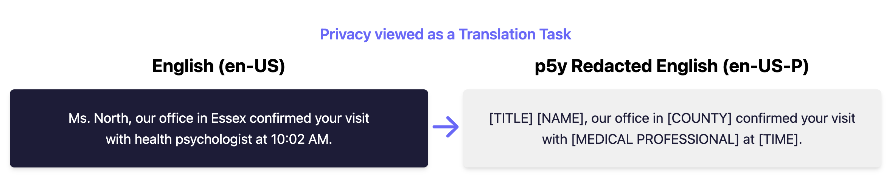
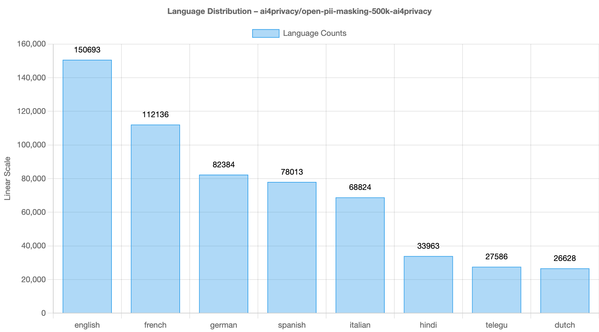
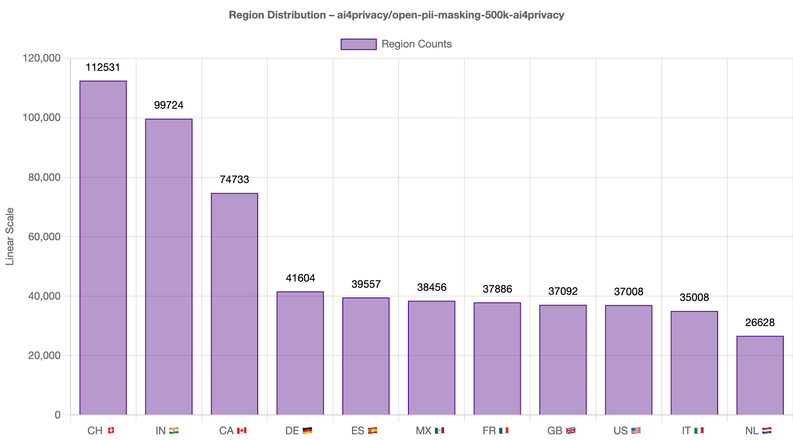
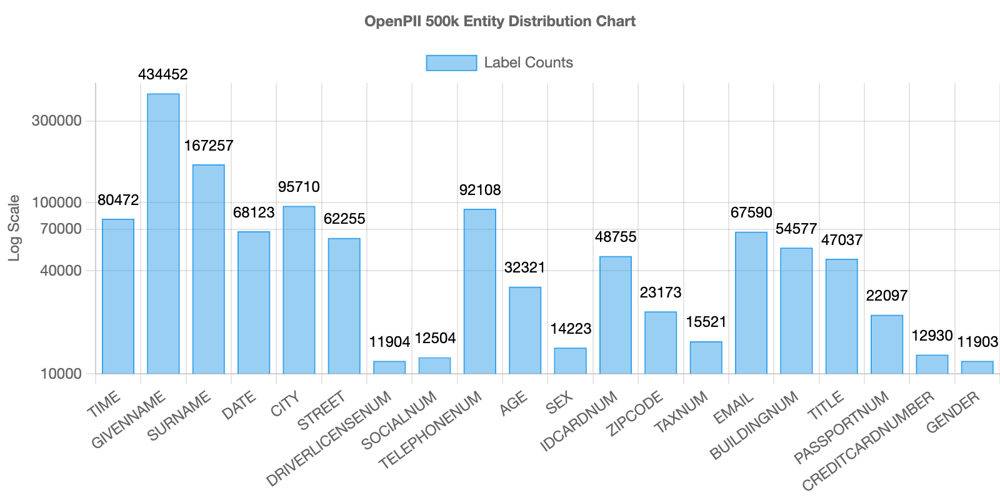

---
license: other
license_name: cc-by-4.0
language:
- en
- fr
- de
- it
- es
- nl
- hi
- te
task_categories:
- text-classification
- token-classification
- table-question-answering
- question-answering
- zero-shot-classification
- summarization
- feature-extraction
- text-generation
- text2text-generation
- translation
- fill-mask
- tabular-classification
- tabular-to-text
- table-to-text
- text-retrieval
- other
multilinguality:
- multilingual
tags:
- legal
- business
- psychology
- privacy
- gdpr
- euaiact
- aiact
- pii
- sensitive
size_categories:
- 100K<n<1M
pretty_name: Open PII Masking 500k Ai4Privacy Dataset
source_datasets:
- original
configs:
- config_name: default
  data_files:
  - split: train
    path: "data/train/*.jsonl"
  - split: validation
    path: "data/validation/*.jsonl"
---

# 🌍 World's largest open dataset for privacy masking 🌎

The dataset is useful to train and evaluate models to remove personally identifiable and sensitive information from text, especially in the context of AI assistants and LLMs. 





# Dataset Analytics 📊 - ai4privacy/open-pii-masking-500k-ai4privacy


## p5y Data Analytics 
- **Total Entries**: 580,227  
- **Total Tokens**: 19,199,982  
- **Average Source Text Length**: 17.37 words  
- **Total PII Labels**: 5,705,973  
- **Number of Unique PII Classes**: 20 (Open PII Labelset) 
- **Unique Identity Values**: 704,215  

---

## Language Distribution Analytics
<div align="center" style="display: flex; gap: 20px; align-items: start">

<div style="flex: 1">
**Number of Unique Languages**: 8  

| Language           | Count    | Percentage |
|--------------------|----------|------------|
| English (en) 🇺🇸🇬🇧🇨🇦🇮🇳     | 150,693  | 25.97%     |
| French (fr) 🇫🇷🇨🇭🇨🇦          | 112,136  | 19.33%     |
| German (de) 🇩🇪🇨🇭          | 82,384   | 14.20%     |
| Spanish (es) 🇪🇸 🇲🇽      | 78,013   | 13.45%     |
| Italian (it) 🇮🇹🇨🇭       | 68,824   | 11.86%     |
| Dutch (nl) 🇳🇱          | 26,628   | 4.59%      |
| Hindi (hi)* 🇮🇳          | 33,963   | 5.85%      |
| Telugu (te)* 🇮🇳         | 27,586   | 4.75%      |
*these languages are in experimental stages

</div>

<div style="flex: 1">

</div>

</div>

---

## Region Distribution Analytics

<div align="center" style="display: flex; gap: 20px; align-items: start">

<div style="flex: 1">

**Number of Unique Regions**: 11  

| Region                | Count    | Percentage |
|-----------------------|----------|------------|
| Switzerland (CH) 🇨🇭  | 112,531  | 19.39%     |
| India (IN) 🇮🇳         | 99,724   | 17.19%     |
| Canada (CA) 🇨🇦        | 74,733   | 12.88%     |
| Germany (DE) 🇩🇪       | 41,604   | 7.17%      |
| Spain (ES) 🇪🇸         | 39,557   | 6.82%      |
| Mexico (MX) 🇲🇽        | 38,456   | 6.63%      |
| France (FR) 🇫🇷        | 37,886   | 6.53%      |
| Great Britain (GB) 🇬🇧 | 37,092   | 6.39%      |
| United States (US) 🇺🇸 | 37,008   | 6.38%      |
| Italy (IT) 🇮🇹         | 35,008   | 6.03%      |
| Netherlands (NL) 🇳🇱   | 26,628   | 4.59%      |

</div>

<div style="flex: 1">

</div>

</div>


---

## Machine Learning Task Analytics
<div align="center" style="display: flex; gap: 20px; align-items: start">

<div style="flex: 1">

| Split       | Count    | Percentage |
|-------------|----------|------------|
| **Train**   | 464,150  | 79.99%     |
| **Validate**| 116,077  | 20.01%     |

</div>

<div style="flex: 1">

</div>
</div>

---


# Usage

Option 1: Python
```terminal
  pip install datasets
```
```python
from datasets import load_dataset
dataset = load_dataset("ai4privacy/open-pii-masking-500k-ai4privacy")
```


# Compatible Machine Learning Tasks:
- Tokenclassification. Check out a HuggingFace's [guide on token classification](https://huggingface.co/docs/transformers/tasks/token_classification).
  - [ALBERT](https://huggingface.co/docs/transformers/model_doc/albert), [BERT](https://huggingface.co/docs/transformers/model_doc/bert), [BigBird](https://huggingface.co/docs/transformers/model_doc/big_bird), [BioGpt](https://huggingface.co/docs/transformers/model_doc/biogpt), [BLOOM](https://huggingface.co/docs/transformers/model_doc/bloom), [BROS](https://huggingface.co/docs/transformers/model_doc/bros), [CamemBERT](https://huggingface.co/docs/transformers/model_doc/camembert), [CANINE](https://huggingface.co/docs/transformers/model_doc/canine), [ConvBERT](https://huggingface.co/docs/transformers/model_doc/convbert), [Data2VecText](https://huggingface.co/docs/transformers/model_doc/data2vec-text), [DeBERTa](https://huggingface.co/docs/transformers/model_doc/deberta), [DeBERTa-v2](https://huggingface.co/docs/transformers/model_doc/deberta-v2), [DistilBERT](https://huggingface.co/docs/transformers/model_doc/distilbert), [ELECTRA](https://huggingface.co/docs/transformers/model_doc/electra), [ERNIE](https://huggingface.co/docs/transformers/model_doc/ernie), [ErnieM](https://huggingface.co/docs/transformers/model_doc/ernie_m), [ESM](https://huggingface.co/docs/transformers/model_doc/esm), [Falcon](https://huggingface.co/docs/transformers/model_doc/falcon), [FlauBERT](https://huggingface.co/docs/transformers/model_doc/flaubert), [FNet](https://huggingface.co/docs/transformers/model_doc/fnet), [Funnel Transformer](https://huggingface.co/docs/transformers/model_doc/funnel), [GPT-Sw3](https://huggingface.co/docs/transformers/model_doc/gpt-sw3), [OpenAI GPT-2](https://huggingface.co/docs/transformers/model_doc/gpt2), [GPTBigCode](https://huggingface.co/docs/transformers/model_doc/gpt_bigcode), [GPT Neo](https://huggingface.co/docs/transformers/model_doc/gpt_neo), [GPT NeoX](https://huggingface.co/docs/transformers/model_doc/gpt_neox), [I-BERT](https://huggingface.co/docs/transformers/model_doc/ibert), [LayoutLM](https://huggingface.co/docs/transformers/model_doc/layoutlm), [LayoutLMv2](https://huggingface.co/docs/transformers/model_doc/layoutlmv2), [LayoutLMv3](https://huggingface.co/docs/transformers/model_doc/layoutlmv3), [LiLT](https://huggingface.co/docs/transformers/model_doc/lilt), [Longformer](https://huggingface.co/docs/transformers/model_doc/longformer), [LUKE](https://huggingface.co/docs/transformers/model_doc/luke), [MarkupLM](https://huggingface.co/docs/transformers/model_doc/markuplm), [MEGA](https://huggingface.co/docs/transformers/model_doc/mega), [Megatron-BERT](https://huggingface.co/docs/transformers/model_doc/megatron-bert), [MobileBERT](https://huggingface.co/docs/transformers/model_doc/mobilebert), [MPNet](https://huggingface.co/docs/transformers/model_doc/mpnet), [MPT](https://huggingface.co/docs/transformers/model_doc/mpt), [MRA](https://huggingface.co/docs/transformers/model_doc/mra), [Nezha](https://huggingface.co/docs/transformers/model_doc/nezha), [Nyströmformer](https://huggingface.co/docs/transformers/model_doc/nystromformer), [QDQBert](https://huggingface.co/docs/transformers/model_doc/qdqbert), [RemBERT](https://huggingface.co/docs/transformers/model_doc/rembert), [RoBERTa](https://huggingface.co/docs/transformers/model_doc/roberta), [RoBERTa-PreLayerNorm](https://huggingface.co/docs/transformers/model_doc/roberta-prelayernorm), [RoCBert](https://huggingface.co/docs/transformers/model_doc/roc_bert), [RoFormer](https://huggingface.co/docs/transformers/model_doc/roformer), [SqueezeBERT](https://huggingface.co/docs/transformers/model_doc/squeezebert), [XLM](https://huggingface.co/docs/transformers/model_doc/xlm), [XLM-RoBERTa](https://huggingface.co/docs/transformers/model_doc/xlm-roberta), [XLM-RoBERTa-XL](https://huggingface.co/docs/transformers/model_doc/xlm-roberta-xl), [XLNet](https://huggingface.co/docs/transformers/model_doc/xlnet), [X-MOD](https://huggingface.co/docs/transformers/model_doc/xmod), [YOSO](https://huggingface.co/docs/transformers/model_doc/yoso)
- Text Generation: Mapping the unmasked_text to to the masked_text or privacy_mask attributes. Check out HuggingFace's [guide to fine-tunning](https://huggingface.co/docs/transformers/v4.15.0/training)
  - [T5 Family](https://huggingface.co/docs/transformers/model_doc/t5), [Llama2](https://huggingface.co/docs/transformers/main/model_doc/llama2)

# Information regarding the rows:
- Each row represents a json object with a natural language text that includes placeholders for PII.
- Sample row:
  - "source_text" shows a natural text containing PII
    - "Subject: Group Messaging for Admissions Process\n\nGood morning, everyone,\n\nI hope this message finds you well. As we continue our admissions processes, I would like to update you on the latest developments and key information. Please find below the timeline for our upcoming meetings:\n\n- wynqvrh053 - Meeting at 10:20am\n- luka.burg - Meeting at 21\n- qahil.wittauer - Meeting at quarter past 13\n- gholamhossein.ruschke - Meeting at 9:47 PM\n- pdmjrsyoz1460 "
  - "target_text" contains a masked version of the source text
    - "Subject: Group Messaging for Admissions Process\n\nGood morning, everyone,\n\nI hope this message finds you well. As we continue our admissions processes, I would like to update you on the latest developments and key information. Please find below the timeline for our upcoming meetings:\n\n- [USERNAME] - Meeting at [TIME]\n- [USERNAME] - Meeting at [TIME]\n- [USERNAME] - Meeting at [TIME]\n- [USERNAME] - Meeting at [TIME]\n- [USERNAME] "
  - "privacy_mask" contains the information explicit format for privacy mask labels
    - [{"value": "wynqvrh053", "start": 287, "end": 297, "label": "USERNAME"}, {"value": "10:20am", "start": 311, "end": 318, "label": "TIME"}, {"value": "luka.burg", "start": 321, "end": 330, "label": "USERNAME"}, {"value": "21", "start": 344, "end": 346, "label": "TIME"}, {"value": "qahil.wittauer", "start": 349, "end": 363, "label": "USERNAME"}, {"value": "quarter past 13", "start": 377, "end": 392, "label": "TIME"}, {"value": "gholamhossein.ruschke", "start": 395, "end": 416, "label": "USERNAME"}, {"value": "9:47 PM", "start": 430, "end": 437, "label": "TIME"}, {"value": "pdmjrsyoz1460", "start": 440, "end": 453, "label": "USERNAME"}], 
  - "span_labels" displays the exact mapping spans of the private information within the text
    - [[440, 453, "USERNAME"], [430, 437, "TIME"], [395, 416, "USERNAME"], [377, 392, "TIME"], [349, 363, "USERNAME"], [344, 346, "TIME"], [321, 330, "USERNAME"], [311, 318, "TIME"], [287, 297, "USERNAME"]], 
  - "mberttokens" indicates the breakdown of the text into tokens associated with multi-lingual bert
    - ["Sub", "##ject", ":", "Group", "Mess", "##aging", "for", "Ad", "##mission", "##s", "Process", "Good", "morning", ",", "everyone", ",", "I", "hope", "this", "message", "finds", "you", "well", ".", "As", "we", "continue", "our", "admission", "##s", "processes", ",", "I", "would", "like", "to", "update", "you", "on", "the", "latest", "developments", "and", "key", "information", ".", "Please", "find", "below", "the", "time", "##line", "for", "our", "upcoming", "meetings", ":", "-", "w", "##yn", "##q", "##vr", "##h", "##0", "##53", "-", "Meeting", "at", "10", ":", "20", "##am", "-", "luka", ".", "bu", "##rg", "-", "Meeting", "at", "21", "-", "q", "##ahi", "##l", ".", "wit", "##tau", "##er", "-", "Meeting", "at", "quarter", "past", "13", "-", "gh", "##ola", "##mh", "##osse", "##in", ".", "rus", "##ch", "##ke", "-", "Meeting", "at", "9", ":", "47", "PM", "-", "p", "##d", "##m", "##jr", "##sy", "##oz", "##14", "##60"]
  - mbert_bio_labels demonstrates the labels associated with the BIO labelling task in Machine Learning using the mbert tokens.
    - ["O", "O", "O", "O", "O", "O", "O", "O", "O", "O", "O", "O", "O", "O", "O", "O", "O", "O", "O", "O", "O", "O", "O", "O", "O", "O", "O", "O", "O", "O", "O", "O", "O", "O", "O", "O", "O", "O", "O", "O", "O", "O", "O", "O", "O", "O", "O", "O", "O", "O", "O", "O", "O", "O", "O", "O", "O", "O", "O", "O", "O", "O", "O", "O", "O", "O", "O", "O", "O", "O", "O", "O", "O", "O", "O", "O", "B-USERNAME", "I-USERNAME", "I-USERNAME", "O", "O", "O", "O", "O", "O", "O", "B-TIME", "I-TIME", "I-TIME", "O", "B-USERNAME", "I-USERNAME", "O", "O", "O", "B-TIME", "I-TIME", "I-USERNAME", "I-USERNAME", "I-USERNAME", "I-USERNAME", "I-USERNAME", "I-USERNAME", "I-USERNAME", "O", "O", "O", "O", "B-TIME", "I-TIME", "I-TIME", "I-TIME", "I-TIME", "I-TIME", "I-TIME", "I-TIME", "I-TIME", "I-TIME", "O", "B-USERNAME", "I-USERNAME"],"
  - "id": indicates the ID of the entry for future reference and feedback
    - "40767A"
  - "language": content of the language
    - "en"
   - "locale": content of the locale associated with the data
  -  "split": type of the machine learning set
    - "train" or "validation"
  
*note for the nested objects, we store them as string to maximise compability between various software.

# About Us:

At Ai4Privacy, we are commited to building the global seatbelt of the 21st century for Artificial Intelligence to help fight against potential risks of personal information being integrated into data pipelines.

Newsletter & updates: [www.Ai4Privacy.com](www.Ai4Privacy.com)
- Looking for ML engineers, developers, beta-testers, human in the loop validators (all languages)
- Integrations with already existing open solutions
- Ask us a question on discord: [https://discord.gg/kxSbJrUQZF](https://discord.gg/kxSbJrUQZF)

# Roadmap and Future Development

- Carbon neutral
- Additional benchmarking methods for NER
- Better multilingual and especially localisation
- Continuously increase the training and testing sets

# Known Issues

- Values in the newly added script are not always matching the script (Te/Hi)

# Use Cases and Applications

**Chatbots**: Incorporating a PII masking model into chatbot systems can ensure the privacy and security of user conversations by automatically redacting sensitive information such as names, addresses, phone numbers, and email addresses.

**Customer Support Systems**: When interacting with customers through support tickets or live chats, masking PII can help protect sensitive customer data, enabling support agents to handle inquiries without the risk of exposing personal information.

**Email Filtering**: Email providers can utilize a PII masking model to automatically detect and redact PII from incoming and outgoing emails, reducing the chances of accidental disclosure of sensitive information.

**Data Anonymization**: Organizations dealing with large datasets containing PII, such as medical or financial records, can leverage a PII masking model to anonymize the data before sharing it for research, analysis, or collaboration purposes.

**Social Media Platforms**: Integrating PII masking capabilities into social media platforms can help users protect their personal information from unauthorized access, ensuring a safer online environment.

**Content Moderation**: PII masking can assist content moderation systems in automatically detecting and blurring or redacting sensitive information in user-generated content, preventing the accidental sharing of personal details.

**Online Forms**: Web applications that collect user data through online forms, such as registration forms or surveys, can employ a PII masking model to anonymize or mask the collected information in real-time, enhancing privacy and data protection.

**Collaborative Document Editing**: Collaboration platforms and document editing tools can use a PII masking model to automatically mask or redact sensitive information when multiple users are working on shared documents.

**Research and Data Sharing**: Researchers and institutions can leverage a PII masking model to ensure privacy and confidentiality when sharing datasets for collaboration, analysis, or publication purposes, reducing the risk of data breaches or identity theft.

**Content Generation**: Content generation systems, such as article generators or language models, can benefit from PII masking to automatically mask or generate fictional PII when creating sample texts or examples, safeguarding the privacy of individuals.

(...and whatever else your creative mind can think of)


# Licensing
This dataset, Open PII Masking 500k, was created using Llama models (versions 3.1 and 3.3) as part of our pipeline at Ai4Privacy. As a result, its use and distribution are subject to the Llama Community License Agreement. Copies of the Llama 3.1 and 3.3 licenses are included in the license folder of this repository. If you use or share this dataset, you must follow these terms, which include specific guidelines for model naming, attribution, and acceptable use. See the “Licensed Material” section below for details.

## Re-publication/Distribution Guidelines
Because we used Llama models as part of our pipeline to generate this dataset, you are required to follow the Llama Community License when using or distributing it or any derivative works. Here’s what you need to do:
Model Naming: If you use this dataset to create, train, fine-tune, or improve an AI model that you distribute, you must include “Llama” at the beginning of the model name (e.g., Llama-ai4privacy-xxx, where xxx is your custom naming convention).
Attribution: You must prominently display “Built with Llama” on any related website, user interface, blog post, about page, or product documentation. This ensures proper credit to the Llama models used in our pipeline.
License Inclusion: When distributing this dataset or any derivative works, include a copy of the Llama Community License (available in the in this repository at llama-3.1-community-license.txt and llama-3.3-community-license.txt).
For full details, please review the licenses in full.

## Acceptable Use
Your use of this dataset must comply with the Llama Acceptable Use Policy (found in the license folder) and align with Ai4Privacy’s mission to protect privacy. Review the licenses for specifics, and follow the guidelines at p5y.org for appropriate usage. Prohibited uses include anything that violates privacy laws, generates harmful content, or contravenes AI regulations.
Citation
If you use this dataset in your research or project, please cite it as follows:

```bibtex
@dataset{ai4privacy_open_pii_masking_500k,
  author = {Ai4Privacy},
  title = {Open PII Masking 500k Dataset},
  year = {2025},
  publisher = {Hugging Face},
  url = {https://huggingface.co/datasets/ai4privacy/open-pii-masking-500k-ai4privacy}
}
```

# Join Our Community
Discord: Connect with us and other privacy enthusiasts on our Discord server: https://discord.gg/FmzWshaaQT

Contribute to Ai4Privacy: Help build the AI ecosystem for privacy by filling out our Open Data Access Form: https://forms.gle/iU5BvMPGkvvxnHBa7
We’re excited to support your research and personal privacy protection efforts! Tell us about your project and how you’re using Ai4Privacy resources—it helps us improve.

# Commercial Partnerships
Is privacy masking a critical challenge for your business? Explore our specialized datasets and get in touch via: https://forms.gle/oDDYqQkyoTB93otHA
Note: These resources are designed to facilitate data handling and processing while upholding high privacy standards in line with regulatory requirements. Uses that fail to protect individuals’ privacy or violate privacy and AI regulations are not permitted. Refer to the Llama Acceptable Use Policy in the license folder for details on permissible and prohibited uses.


# **Legal Disclaimer**  

**No Warranty & Use at Your Own Risk**  
The **Open PII Masking 500k Ai4Privacy Dataset** is provided **"as is"** without any guarantees or warranties, express or implied. Ai4Privacy and Ai Suisse SA make **no representations or warranties** regarding the accuracy, completeness, reliability, or suitability of the dataset for any specific purpose. Users acknowledge that they utilize the dataset **at their own risk** and bear full responsibility for any outcomes resulting from its use.  

**No Liability**  
Under no circumstances shall **Ai4Privacy, Ai Suisse SA, its affiliates, partners, contributors, or employees** be held liable for **any direct, indirect, incidental, consequential, or special damages** arising from the use or inability to use the dataset, including but not limited to data loss, privacy breaches, regulatory non-compliance, reputational damage, or any other harm, even if advised of the possibility of such damages.  

**Compliance & Responsibility**  
Users are solely responsible for ensuring that their use of the dataset complies with **all applicable laws, regulations, and ethical guidelines**, including but not limited to data privacy laws (e.g., GDPR, CCPA) and AI-related legislation. Ai4Privacy and Ai Suisse SA assume **no responsibility** for how users process, distribute, or apply the dataset in their projects, commercial or otherwise.  

**Intellectual Property & Third-Party Rights**  
The dataset may include automatically processed data for PII masking purposes. Ai4Privacy and Ai Suisse SA **do not guarantee** that all sensitive information has been successfully removed or anonymized. Users must conduct **their own due diligence** and, where necessary, implement additional safeguards before using or sharing any derived outputs.  

**License & Restrictions**  
Use of the dataset is subject to the license terms set forth in the [LICENSE.md](LICENSE.md) file. Commercial use, redistribution, or modification beyond the permitted scope may require explicit **written permission** from Ai4Privacy. Unauthorized use may result in legal consequences.  

**No Endorsement**  
Use of this dataset does not imply **endorsement, affiliation, or approval** by Ai4Privacy, Ai Suisse SA, or any related entities. Any conclusions, analyses, or outputs derived from this dataset are **entirely the responsibility of the user**.  

**Changes & Termination**  
Ai4Privacy reserves the right to **update, modify, restrict, or discontinue** access to the dataset at any time, without prior notice. Users should regularly review licensing terms and any dataset updates to ensure continued compliance.  

Ai4Privacy is a project affiliated with [Ai Suisse SA](https://www.aisuisse.com/).